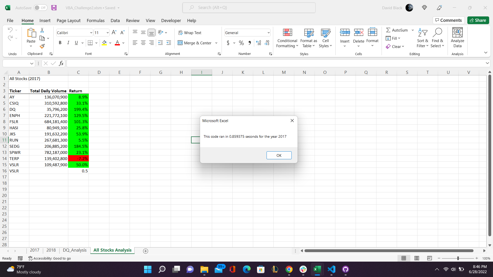
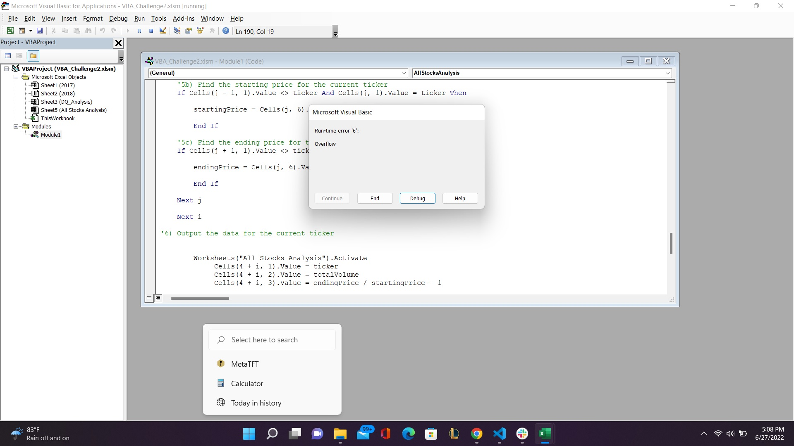

# stock-analysis
 week 2
# **Steve Stock Analysis**

### **Overview of Project**
The purpose of this project was to help Steve and his parents understand which stocks made the most sense to invest in. While there are multiple stocks to choose from, Steve's parents wanted a overview of all the stock options and the outcomes of each stock in 2017 and 2018 so that they can make an informed decision on which stocks to invest in that provided a good return on investment.

We could have run the data individually but the purpose of this project was to allow our clients actively choose which year they would like the data to run through rather than manually doing it. This would make the process much more efficent for the client to see especially when they are mutiple years to consider and compare to.  

### **Results**
Based on the data provided, we ran a code that would scrub through the given data and output the information we wanted to see in a different worksheet. Once we received the data we wanted, we were able to understand which stocks still provided return from 2017 to 2018 and which stocks did not. We noticed that there were only two stocks that has shown proven return in the given two years and they are **ENPH** and **RUN**. 
        Below are images that represent the scrubbed data for both 2017 and 2018

 
 

### **Summary**
When it comes to refactoring the code there are advantages and disadvantages
The Advantages to refactoring the code is making it more proficient and quicker to run the given data.
The Disadvantages to refactoring the code would be running the risk of messing the original but working code up.
I persoanlly have had multiple complications on trying to get the refactored code to work. The first complication was trying to get to input the "tickerIndex" from the start and incorporating it throughout the project. Once I understood that all I had to do was replace "totalvolume" with "tickerIndex" then it all made sense. "tickerIndex" allowed the Macro to pull the date based on the year inputed in the InputBox. 
The next issue I ran into is once I started messing with the original data and adding in or replacing values the Macro kept giving me Error Messages.
        
I first had no idea what was causing it until I ended up clicking "debug" which showed me which line was causing the issue. Even then I was unable to understand why. I ended up asking for help in AskBCS which concluded that my values were not correct to my previous values. After looking over every line of the code I realized that a single "s" caused the whole issue. When I inputed "tickerVolumes" first, i realized that I didnt follow through in adding the "s" at the end later down the line of codes, which made the Macro very confused on what I was asking. I learned that 1 single letter can be the sole reason that the whole Macro will not work. That causes hours of frustraction and google reviews.
